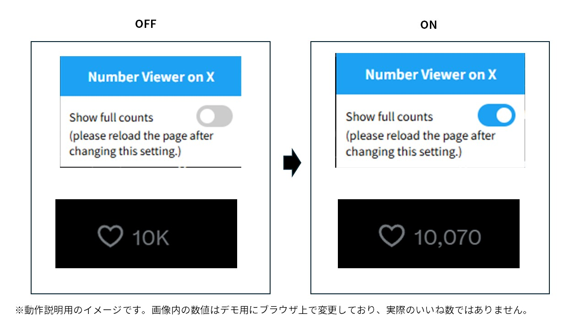

# Number Viewer on X

Xで省略表示される「いいね数」を、カンマ区切りの正確な数値で表示するChrome拡張機能です。


<p align="center">
  
</p>

## 概要

Xでは、いいね数が多いポストについて `1.2万` や `10K` のような省略表記が使われます。この拡張機能は、いいねボタンのアクセシビリティ情報から正確な値を取得し、画面上の表示を `12,345` のような形式に置き換えます。

## 主な機能

- 省略されているいいね数を正確な数値で表示
- 拡張機能のポップアップからON・OFFを切り替え
- 設定をブラウザ内に保存し、次回起動時にも状態を維持
- 無限スクロールで追加されたポストにも自動で適用
- OFFにした際は、変更前の表示へ復元

## 使用技術

- JavaScript
- HTML / CSS
- Chrome Extension Manifest V3
- Chrome Storage API
- MutationObserver API

## インストール

Chromeウェブストアには公開していないため、デベロッパーモードを利用して手動でインストールします。

1. このリポジトリをクローンするか、GitHubの「Code」からZIPファイルをダウンロードして展開します。

   ```bash
   git clone https://github.com/yukidev630/NumberViewerOnTwitter.git
   ```

2. Chromeで `chrome://extensions/` を開きます。
3. 画面右上の「デベロッパーモード」を有効にします。
4. 「パッケージ化されていない拡張機能を読み込む」を選択します。
5. ダウンロードまたはクローンしたフォルダを指定します。

## 使い方

1. インストール後、[X](https://x.com)を開きます。
2. 省略されていたいいね数が、正確な数値で表示されることを確認します。
3. Chromeの拡張機能メニューから「Number Viewer on X」を開くと、機能のON・OFFを切り替えられます。

設定変更がすぐに反映されない場合は、Xのページを再読み込みしてください。

## ファイル構成

| ファイル | 役割 |
| --- | --- |
| `manifest.json` | 拡張機能の設定、権限、対象ページの定義 |
| `content.js` | いいね数の取得、表示の書き換え、DOM監視 |
| `popup.html` | ON・OFFを切り替えるポップアップUI |
| `popup.js` | 設定の読み込みと保存 |

## プライバシー・注意事項

- 入力内容やアカウント情報を外部サーバーへ送信する処理はありません。
- 設定値はChrome Storage APIを利用してブラウザ内に保存します。
- ポストの投稿、削除、いいねなど、X上のアカウント操作は行いません。
- Xの仕様変更やUIアップデートにより、正常に動作しなくなる可能性があります。
